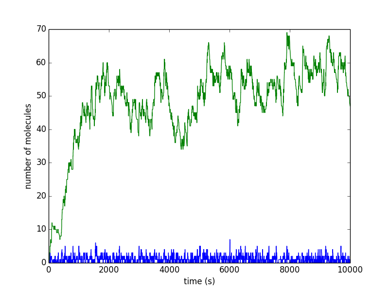

Examples
========

Here's what Dijkstra's algorithm looks like using a ``pqdict``.

.. raw:: html

	

-----

This is an example of a stochastic simulation algorithm that simulates chemical reactions with small numbers of molecules.

.. raw:: html

	

Output:

